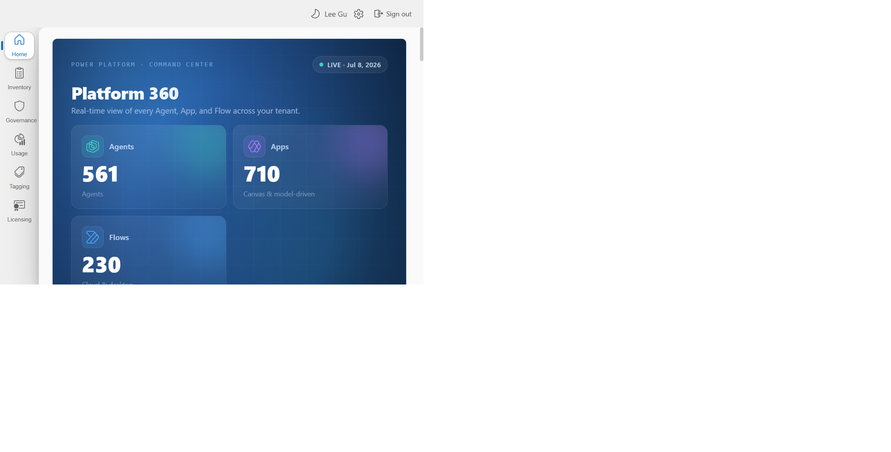

# Platform 360: A Power Platform Inventory and Governance App

> [!IMPORTANT]
> **Unsupported sample code:** This repository is provided for educational, demonstration, and exploratory use only. It is not a Microsoft product and is not supported by Microsoft. Microsoft Support cannot provide assistance or production-readiness assurances for it. The code is provided as-is, without warranty or SLA. Review the permissions, source, data handling, and deployment scripts before use. See [SUPPORT.md](SUPPORT.md).

A browser-based inventory, governance, and usage dashboard for Power Platform admins. It surfaces apps, cloud flows, Copilot Studio agents, environments, governance insights, billing policies, licensing, sign-in usage, and resource tagging in a single read-only view, authenticated through your own Microsoft Entra ID app registration.

---

> ## IMPORTANT RESPONSIBILITY NOTICE
>
> - This sample is not production-ready and has not been hardened, performance-tested, or security-reviewed for enterprise use.
> - You accept responsibility for its use, including unintended data access, Azure costs, and tenant configuration changes.
> - Read the setup instructions and understand each delegated permission before using real tenant data.
> - This application calls live Microsoft APIs using credentials you supply. Ensure you understand the permissions being granted before proceeding.
> - Follow your organization's security, privacy, and compliance policies.

---

## What it does

| Section | Description |
|---|---|
| **Home** | Live Agent / App / Flow counts, environment governance health, compliance state, and a resource dashboard |
| **Inventory** | Browse all resources — Apps (canvas / model-driven / code), Flows (cloud / agent), Agents (Copilot Studio / M365), Environments, Environment Groups, and Users — with search and a detail panel (configuration, sharing, activity) |
| **Governance** | Overview & resource insights, Cross-Tenant Connections, Connections, Recommendations, Maker Analytics, and Risk Assessments |
| **Usage** | Adoption analytics from Entra sign-ins + inventory: active users, sessions, success rate, geography, top users; per-product (Apps / Flows / Agents) drill-ins; and a world **Heatmap** of where users sign in |
| **Tagging** | Browse and tag resources, backed by a SharePoint-style Term Store (groups, term sets, terms) |
| **Licensing** | Power Platform license capacity and SKU utilization, plus pay-as-you-go billing policies and environment assignments |

Most data is fetched live from the Power Platform, Power Apps Service, and Microsoft Graph APIs using your signed-in user's **delegated** permissions and held only in your browser session. Optionally, an Azure Storage account (account-level Table SAS) can persist risk assessments, resource tags, and a cached sign-in dataset for the usage heatmap — see the [hosting guide](docs/03-azure-static-web-apps.md). Without it, those features fall back to `localStorage` or live fetches.

## Screenshot Gallery

Homepage:



Browse the full capture set in [docs/screenshots/README.md](docs/screenshots/README.md).

## Documentation

| Guide | Description |
|---|---|
| [Prerequisites](docs/01-prerequisites.md) | What you need before you start |
| [App Registration & Admin Consent](docs/02-app-registration.md) | Create the Azure AD app and grant consent |
| [Azure Static Web Apps](docs/03-azure-static-web-apps.md) | Host the app in Azure |
| [User Guide](docs/04-user-guide.md) | How to use the dashboard |
| [API Reference](docs/05-api-reference.md) | All APIs called, with links to official docs |
| [GitHub Actions Deployment](docs/06-github-actions-deployment.md) | Automated deployment via GitHub Actions on every push to main |

## Quick start (summary)

For the minimum local setup:

1. Install Node.js 20 LTS or later and Git.
2. [Create a single-tenant SPA app registration](docs/02-app-registration.md) with `http://localhost:3000` as a redirect URI.
3. Add the Power Platform API delegated permission and grant tenant admin consent. No Business Application Platform (BAP) API permission is used or required.
4. Copy `.env.example` to `.env.local`; set only `VITE_CLIENT_ID` and `VITE_TENANT_ID`.
5. Run:

	```bash
	npm install
	npm run dev
	```

6. Open `http://localhost:3000` and sign in with a Power Platform Administrator or Global Administrator account.

Microsoft Graph, Power Apps Service, Azure Table Storage, GitHub, and Azure Static Web Apps are optional. Add them only for the corresponding features or hosted deployment described in the guides.

## Technology stack

- [React 18](https://react.dev/) + [TypeScript](https://www.typescriptlang.org/)
- [Vite](https://vitejs.dev/) build tooling
- [Fluent UI v9](https://react.fluentui.dev/) component library
- [MSAL Browser](https://github.com/AzureAD/microsoft-authentication-library-for-js) for Azure AD authentication
- [TanStack Query](https://tanstack.com/query) for data fetching and caching
- [Azure Static Web Apps](https://learn.microsoft.com/azure/static-web-apps/overview) for hosting

## APIs used

- [Power Platform Resource Query API](https://learn.microsoft.com/rest/api/power-platform/) — apps, flows, agents, environments inventory
- [Power Platform API](https://learn.microsoft.com/rest/api/power-platform/) — governance, Advisor, cross-tenant reporting, and billing policies
- [Power Apps Service API](https://learn.microsoft.com/connectors/powerappsforadmins/) — resource sharing / permissions
- [Microsoft Graph API](https://learn.microsoft.com/graph/overview) — user name resolution (`User.ReadBasic.All`), license capacity (`Organization.Read.All`), and sign-in logs for the usage heatmap (`AuditLog.Read.All`)
- [Azure Table Storage](https://learn.microsoft.com/rest/api/storageservices/table-service-rest-api) *(optional)* — persists risk assessments, tags, and the cached sign-in dataset via an account-level SAS

See [API Reference](docs/05-api-reference.md) for full details.

## License

MIT — see [LICENSE](LICENSE).

The MIT license does not imply Microsoft support. See [SUPPORT.md](SUPPORT.md).
